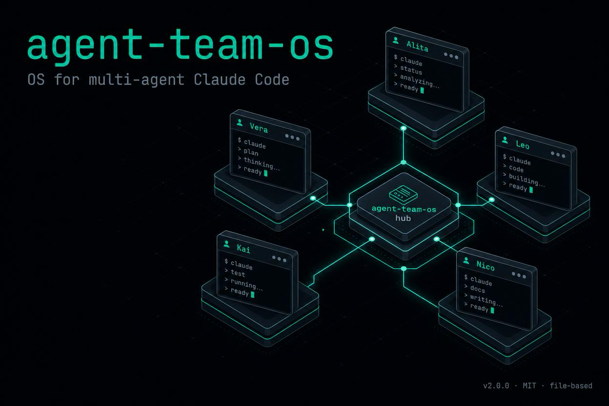
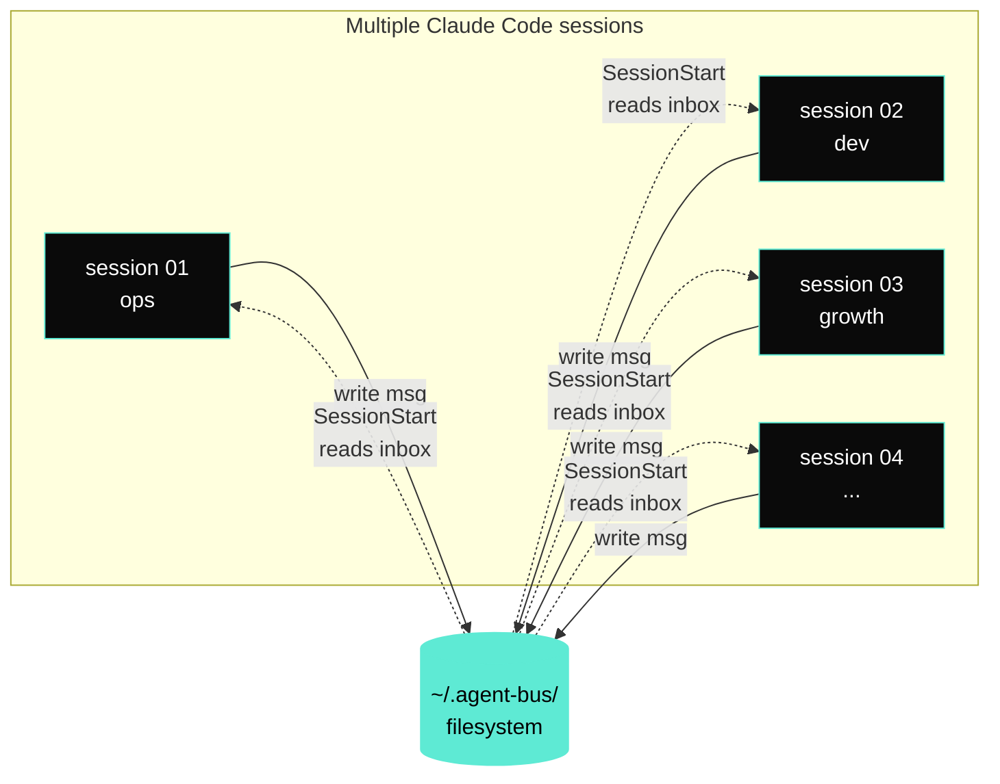
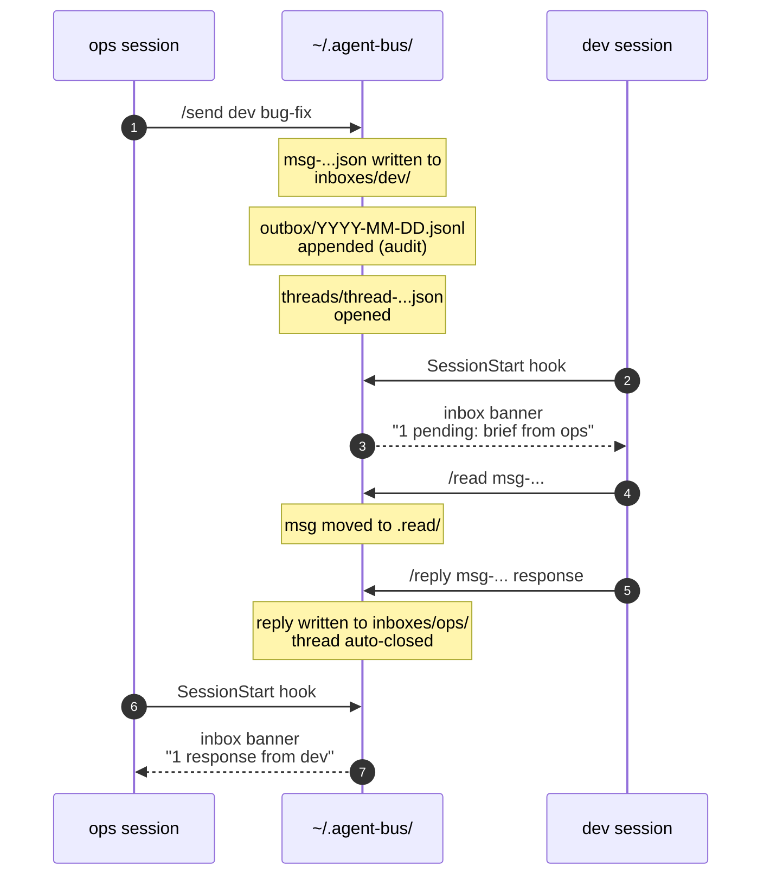
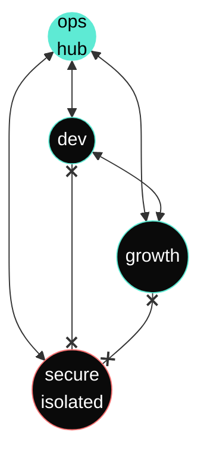

# Agent Bus



> A minimal file-based protocol to coordinate multiple Claude Code instances across separate sessions.

[](https://opensource.org/licenses/MIT)
[](https://github.com/mariomosca/agent-bus/releases/latest)

## Why

If you run more than one Claude Code session — one per project, one per role, one per repo — you quickly hit a wall: the sessions don't talk to each other. You become the human postman, copy-pasting context, briefs and handoffs between terminals.

Agent Bus removes the postman.

It's a tiny convention — a folder structure, a JSON message schema, a handful of bash helpers and slash commands — that lets each Claude Code instance read its own inbox at session start, send structured messages to its peers, and resume threaded conversations days later.

No daemon. No server. No cloud. Just files on your machine.

## What it gives you

- **Inbox per agent** — each session sees what's waiting for it the moment you open it
- **Structured messages** — versioned JSON with `from`, `to`, `intent`, `payload`, `context_refs`, deadlines
- **Threads** — replies stay grouped, so you can pick up a conversation a week later
- **Routing rules** — declare which agents can talk to which (e.g. isolate work contexts from personal ones)
- **Audit log** — append-only JSONL of every message sent, for free
- **Slash commands** — `/inbox`, `/read`, `/send`, `/reply`, `/handoff`, `/thread`, `/bus`

## How it works

```
~/.agent-bus/
  AGENT_MAP.json              # path -> agent + capabilities + routing rules
  registry/<agent>.json       # agent card (active, last_seen, workspace_path)
  inboxes/<agent>/            # pending msg-*.json
  inboxes/<agent>/.read/      # local archive after read
  threads/<thread-id>.json    # conversation history
  outbox/YYYY-MM-DD.jsonl     # append-only audit log
  locks/                      # mkdir-based atomic locks
```

Each Claude Code session detects its identity from its current working directory via `AGENT_MAP.json`. A `SessionStart` hook registers the agent and prints any pending inbox messages. Slash commands handle the rest.

### Architecture at a glance



No daemon listens. Every session writes to and polls the filesystem independently. The hook only fires on session boundaries — there's nothing running between turns.

### Message lifecycle



A request → response cycle never has both sessions live at the same time. Filesystem is the rendezvous.

### Routing rules



Declare blocked pairs in `AGENT_MAP.json` to keep contexts isolated. Cross-impact between walled agents must route through the hub.

## Install

### Option A — As a Claude Code plugin (recommended)

In any Claude Code session:

```
/plugin marketplace add mariomosca/claude-plugins
/plugin install agent-bus@mariomosca-claude-plugins
```

The plugin registers its hooks, skill and slash commands automatically. On first run it drops a starter `AGENT_MAP.json` in `~/.agent-bus/` for you to edit.

### Option B — Manual install

If you'd rather not use the plugin marketplace, the bundled installer does the same job:

```bash
git clone https://github.com/mariomosca/agent-bus.git ~/agent-bus
cd ~/agent-bus
./install.sh
```

The installer:

1. Copies the helper library to `~/.claude/scripts/agent-bus-lib.sh`
2. Copies the `SessionStart` hook to `~/.claude/hooks/agent-bus-load.sh`
3. Copies the slash commands to `~/.claude/commands/`
4. Copies the auto-attaching skill to `~/.claude/skills/agent-bus/`
5. Creates `~/.agent-bus/` runtime folders
6. Drops a starter `AGENT_MAP.json` you can edit

In both cases, edit `~/.agent-bus/AGENT_MAP.json` to map your working directories to agent names.

## Example: define your agents

```json
{
  "version": "1.2",
  "rules": [
    { "pattern": "/Users/me/work",      "match": "prefix", "agent": "ops" },
    { "pattern": "/Users/me/projects",  "match": "prefix", "agent": "dev" },
    { "pattern": "/Users/me/marketing", "match": "prefix", "agent": "growth" }
  ],
  "fallback": "ops",
  "agents": {
    "ops":    { "role": "orchestrator", "capabilities": ["planning", "tracking"] },
    "dev":    { "role": "engineer",     "capabilities": ["bug-fix", "code-review", "refactor"] },
    "growth": { "role": "content",      "capabilities": ["draft-post", "review-copy"] }
  },
  "routing": {
    "blocked_pairs": []
  }
}
```

## Example: send a message

From your `ops` session:

```
/send dev bug-fix
```

The wizard collects payload, deadline, context references and writes a JSON message to `~/.agent-bus/inboxes/dev/`.

Next time you open a Claude Code session in `/Users/me/projects/...`, the `SessionStart` hook prints:

```
=== Agent Bus ===
You are dev. Inbox: 1 pending.
  - msg-20260520T091812Z-x7q3  [normal] brief/bug-fix from ops  (by 2026-05-23T18:00:00+02:00)
```

Then:

```
/read msg-20260520T091812Z-x7q3
```

…shows the full payload, resolves `context_refs` (file paths, GitHub issues, knowledge graph nodes), and moves the message to `.read/`.

When done:

```
/reply msg-20260520T091812Z-x7q3 response
```

…closes the thread and notifies the sender.

## Message schema (v1.0)

```json
{
  "id": "msg-<iso-compact>-<rand8>",
  "version": "1.0",
  "from": "ops",
  "to": "dev",
  "thread_id": "thread-YYYYMMDD-<rand>",
  "in_reply_to": null,
  "type": "request | response | brief | handoff | question | review-request | event | confirm | decline",
  "intent": "bug-fix | draft-post | code-review | ...",
  "priority": "urgent | high | normal | low",
  "payload": { },
  "context_refs": [
    "file:///abs/path",
    "gh://owner/repo/issues/123",
    "graphiti://node/<uuid>",
    "wiki://<slug>"
  ],
  "requires_response": true,
  "response_by": "iso-8601",
  "ts": "iso-8601"
}
```

Constraints: payload under 10KB, no secrets, ISO-8601 timestamps with timezone, heavy content lives behind `context_refs`.

## Routing rules

You can declare blocked pairs in `AGENT_MAP.json` to keep contexts isolated — for example, prevent a personal content agent from messaging a work-only engineering agent. The `ab_write_message` helper refuses messages that violate the rules (exit code 2).

## Slash commands

| Command | What it does |
|---------|--------------|
| `/bus`     | Show roster, capabilities and routing rules |
| `/inbox`   | List pending messages for the current agent |
| `/read <id>` | Read a message, resolve context_refs, archive it |
| `/send <to> <intent>` | Wizard to compose a new message |
| `/reply <id> <type>`  | Reply to a message inside its thread |
| `/handoff <to>` | Hand off the current task to another agent |
| `/thread <id>`  | Show full thread history |

## Status

- **v1.0**: file-based protocol, bash helpers, slash commands, `SessionStart` hook — battle-tested across five concurrent agents in production since May 2026.
- **v1.1+**: realtime delivery, conductor pattern, active driver, autonomous mode with guard-rails — see [ROADMAP.md](./ROADMAP.md).

## Why not just use one Claude Code instance?

Because context is finite. One instance per role — engineering, marketing, ops — keeps each session focused, lets each one carry its own conventions, skills and memory, and stops them from stepping on each other's toes. The cost is coordination. Agent Bus is the cheapest possible coordination layer.

## Contributing

PRs welcome. The schema is versioned (`version: "1.0"`) so backwards-compatible additions are easy. Breaking changes bump the major.

## License

[MIT](./LICENSE) — use it, fork it, adapt it. Attribution appreciated, not required.

---

Built by [Mario Mosca](https://github.com/mariomosca) — AI Transformation Manager & indie builder. Originally extracted from a personal multi-agent setup running five Claude Code sessions in parallel.
